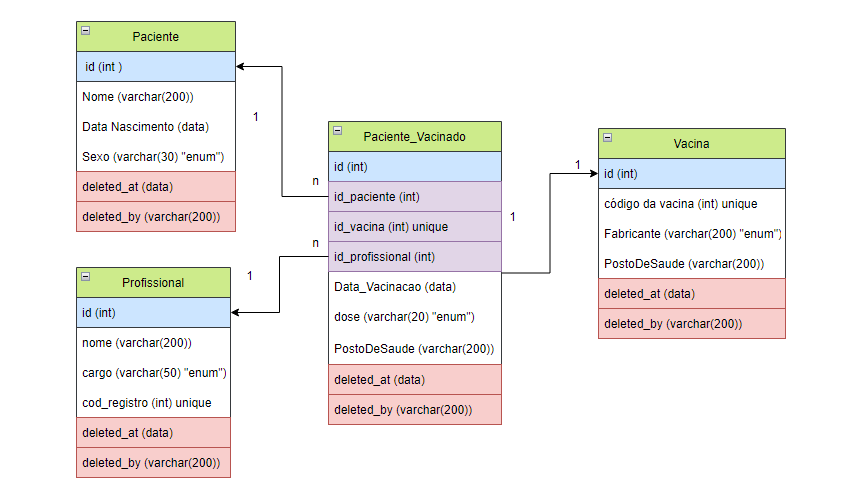
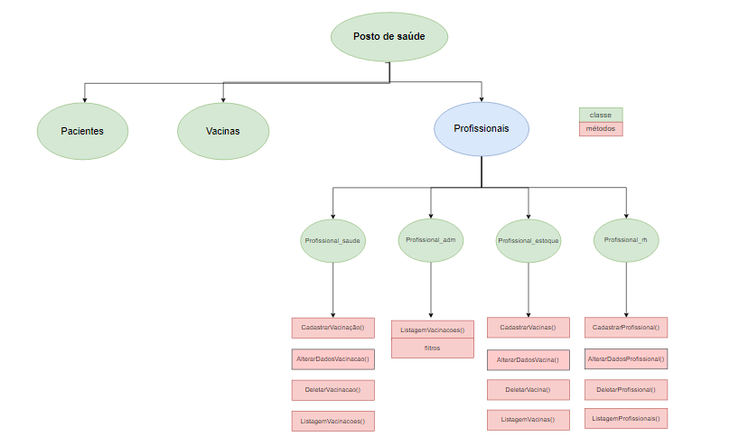

-----------
## Projeto final - Módulo BANCO DE DADOS  :octocat:
-----------
 
Este é o repositório do nosso projeto final do Módulo de Banco de Dados do curso da Lets's Code.
A proposta é desenvolver sistema para cadastros de Vacinação dos Postos de Saúde de uma certa cidade (Campinas do Sul, no nosso exemplo).

Integrantes do grupo - Squad Verde: <br>
-Camily Aleixo Randi <br>
-Everton Sebastião do Nascimento <br>
-Gabriela Trindade Ferreira <br>
-Isadora Oliveira Rogieri <br>

&nbsp;
Esse sistema possui:
 
        ⬛ Cadastro de Vacinas que chegaram ao posto;
 
        ⬛ Cadastro de Vacinação Efetuada, que engloba:
 
             ⬜ Cadastro de Pessoa(paciente), caso ela ainda não esteja cadastrada no sistema
 
        ⬛ Listagem de Vacinações efetuadas;

             ⬜ Com Filtros
             
        ⬛ Listagem de Vacinas disponíveis;

        ⬛ Alteração de cadastros previamente realizados;

             ⬜ Alterar dados da vacina
             ⬜ Alterar dados da Pessoa
             ⬜ Alterar dados da Vacinação Realizada

        ⬛ Deletar cadastros realizados;
        
            ⬜ Deletar Vacina
            ⬜ Deletar Pessoa
            ⬜ Deletar histórico de vacinação
            
  
  _____________________________________________________________________________________________________________________________________
 
        
 ### Planejamento
 
 
 *Modelagem inicial do Banco de dados*
 
 

 *Projeto inicial da Aplicação*
 
 

 
### ! Regras de negócio
* Cada pessoa pode tomar várias doses da vacina , mas será cadastrada apenas uma vez.
* Cada vacina só pode ser registrada em uma aplicação.
* Listagem de vacinas disponíveis não englobam aquelas que já foram usadas em aplicações anteriores, nem deletadas do sistema.
* O tipo de exclusão é Soft Delete
* Os profissionais de cada área possuem métodos diferentes que apenas eles podem realizar.
* Os aplicadores devem ser apenas os profissionais da saúde.

_______________________________________________________________________________________________________________________________________

### Desenvolvimento

| 😃        | Banco de Dados | Aplicação |  C   |  R   |   U   |   D|
|-----------| ---------- | ---------- | --------  | ---------  |  -------  |  ----------|
| E         | ⚫ | ⚫ | ⚫ |  ⚫   |  ⚫  | ⚫|
| I         | ⚫ | ⚫ | ⚫ |  ⚫   |  ⚫  | ⚫|
| G         | ⚫ | ⚫ | ⚫ |  ⚫   |  ⚫  | ⚫|
| C         | ⚫ | ⚫ | ⚫ |  ⚫   |  ⚫  | ⚫|
|  Aprovado | ⬜  | ⬜ | ⬜ | ⬜   | ⬜  | ⬜ |

 ```
 Legenda

  🟢 Já trabalhei nessa parte do projeto
  
  🟡 Trabalhando nessa parte do projeto (especificar se possível)
  
  🔴 Encontrei algum problema aqui (precisa de ajuda ou revisar o projeto)
```  
